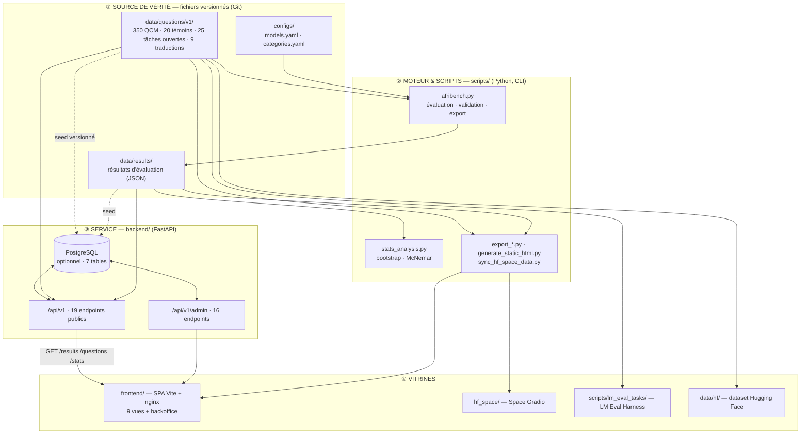
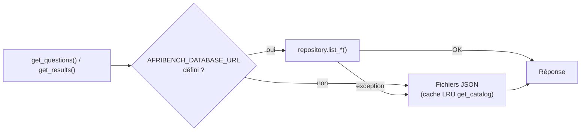
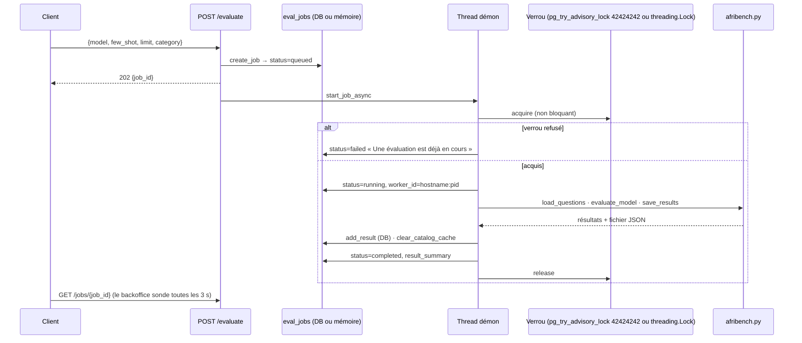
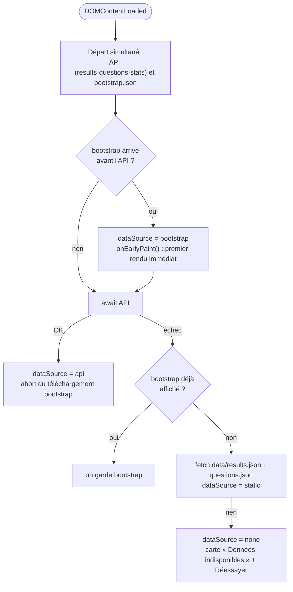
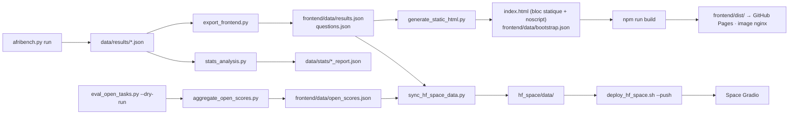
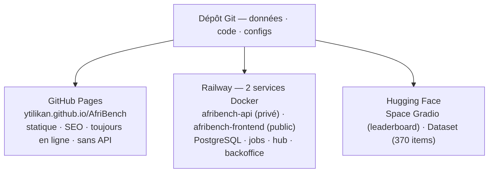

# AfriBench — Architecture et conception

**Objet :** comment AfriBench est construit, et pourquoi chaque choix a été fait.
**Version du document :** 1.0 — 7 septembre 2026 · **Version du produit :** prototype v0.1
**Public :** toute personne qui veut comprendre, auditer, faire évoluer ou reproduire le système — développeur, chercheur, contributeur, décideur.
**Dépôt :** [github.com/YTILIKAN/AfriBench](https://github.com/YTILIKAN/AfriBench)

> Tous les chiffres de ce document ont été **recomptés sur le dépôt à la date indiquée**, par exécution (tests lancés, routes introspectées, fichiers comptés), et non repris d'une documentation antérieure. Quand un chiffre change, c'est ce document qu'il faut corriger en premier ; les autres s'y réfèrent.

---

## Comment lire ce document

Ce document est le **plan de l'édifice**. Il ne raconte pas l'histoire du projet (c'est le rôle du [rapport technique](RAPPORT_TECHNIQUE.md)) et ne liste pas ses défauts (c'est le rôle de l'[audit](AUDIT_QUALITE.md) et de la [critique](../CRITIQUE.md)). Il répond à deux questions, pour chaque composant : **comment est-ce construit ?** et **pourquoi ainsi et pas autrement ?**

Deux niveaux de lecture cohabitent :

- Les encadrés **« En clair »** expliquent chaque idée avec une image du quotidien. On peut ne lire que ces encadrés et sortir avec une compréhension juste de l'architecture.
- Le corps du texte donne les chemins de fichiers, les signatures, les chiffres exacts et les références au code.

Les décisions structurantes sont consignées en **fiches de décision** (§ 12), sur le modèle des *Architecture Decision Records* : contexte, décision, conséquences, alternatives écartées. C'est la partie qui répond au « pourquoi ».

---

## Table des matières

1. [Le problème que le système résout](#1-le-problème-que-le-système-résout)
2. [Principes de conception](#2-principes-de-conception)
3. [Vue d'ensemble du système](#3-vue-densemble-du-système)
4. [La couche données : source de vérité](#4-la-couche-données--source-de-vérité)
5. [Le moteur d'évaluation](#5-le-moteur-dévaluation)
6. [Le service API (backend)](#6-le-service-api-backend)
7. [L'interface (frontend)](#7-linterface-frontend)
8. [La chaîne de publication et les exports](#8-la-chaîne-de-publication-et-les-exports)
9. [Sécurité : modèle de menace et défenses](#9-sécurité--modèle-de-menace-et-défenses)
10. [Qualité : tests, lint et garde-fous d'intégration continue](#10-qualité--tests-lint-et-garde-fous-dintégration-continue)
11. [Déploiement et exploitation](#11-déploiement-et-exploitation)
12. [Fiches de décision (pourquoi ainsi)](#12-fiches-de-décision-pourquoi-ainsi)
13. [Dette technique assumée et limites de conception](#13-dette-technique-assumée-et-limites-de-conception)
14. [Guide d'extension : comment ajouter…](#14-guide-dextension--comment-ajouter)
15. [Annexes](#annexe-a--cartographie-du-dépôt)

---

## 1. Le problème que le système résout

Un *benchmark* de modèles de langage est un examen standardisé. AfriBench doit :

1. **Tenir le sujet** — un corpus de questions sourcées, versionnées, auditables, sur les réalités africaines francophones.
2. **Faire passer l'examen** — interroger des modèles de plusieurs fournisseurs dans des conditions strictement identiques, et corriger sans ambiguïté.
3. **Publier le palmarès** — rendre les scores lisibles par tout le monde, avec leur marge d'erreur, et les rendre citables par la recherche.
4. **Rester honnête** — ne jamais laisser un chiffre paraître plus solide qu'il ne l'est, et le dire dans l'interface elle-même.
5. **Fonctionner dans nos conditions** — connexions instables, budgets d'inférence limités, petite équipe, hébergement gratuit ou presque.

Les contraintes 4 et 5 ne sont pas des contraintes secondaires : ce sont elles qui expliquent la majorité des choix d'architecture décrits plus bas.

> **En clair.** Il faut écrire un examen, le faire passer à des candidats qui parlent des langues d'API différentes, corriger les copies avec la même règle pour tous, afficher les résultats sans tricher sur la précision — et faire tout cela avec un groupe électrogène plutôt qu'une centrale.

---

## 2. Principes de conception

Six principes gouvernent le système. Chaque décision du § 12 se rattache à au moins l'un d'eux.

| # | Principe | Ce qu'il impose concrètement |
|---|---|---|
| P1 | **Le fichier est la vérité** | Le corpus et les résultats vivent dans des fichiers JSON versionnés par Git. Toute base de données est une *copie de travail*, jamais l'original. |
| P2 | **Dégradation gracieuse** | Chaque composant sait fonctionner sans celui qui est en dessous : le site sans l'API, l'API sans la base, l'évaluation sans clé. Et il *dit* qu'il est dégradé. |
| P3 | **Reproductibilité outillée** | Une commande rejoue tout. L'environnement est figé (Docker), le hasard est éliminé (température 0) ou fixé (graines), le protocole est le même dans nos outils et dans l'outil standard de la communauté. |
| P4 | **Honnêteté exécutable** | L'incertitude, la couverture de validation et l'état de complétude ne sont pas des phrases dans un README : ce sont des endpoints, des bannières calculées et des étapes de CI. |
| P5 | **Sobriété** | Peu de dépendances, pas de framework frontend, pas de file de messages, bundle léger. Chaque brique ajoutée est une brique à comprendre pour un contributeur débutant et un mégaoctet à télécharger sur mobile. |
| P6 | **Sécurité par défaut fermé** | Une fonctionnalité dont le secret n'est pas configuré n'existe pas (503), l'en-tête `X-Forwarded-For` n'est pas cru sans déclaration, et tout texte de données passe par un échappement vérifié par le lint. |

---

## 3. Vue d'ensemble du système

### 3.1 Les quatre étages



> **En clair.** Le projet est bâti comme un journal. La **rédaction** (①) écrit et conserve les textes. L'**imprimerie** (②) fabrique les tirages : résultats, statistiques, exports. Le **kiosque** (③) distribue à la demande, avec un guichet réservé aux employés. Les **vitrines** (④) exposent au public, chacune à sa façon : le site, le Space Hugging Face, le format standard de la recherche. Chaque étage peut tomber sans faire tomber celui du dessus — et le kiosque continue de servir les anciens tirages si l'imprimerie est à l'arrêt.

### 3.2 Dépendances entre composants

| Composant | Dépend de | Fonctionne sans |
|---|---|---|
| `scripts/afribench.py` | `configs/`, `data/questions/`, clés d'API (sauf `--mock`) | backend, frontend, base de données |
| `backend/` | `data/` (fichiers), `configs/`, `scripts/afribench.py` (import dynamique) | PostgreSQL, Redis, frontend |
| `frontend/` | `frontend/data/*.json` (repli) | backend (mode statique), JavaScript (classement pré-généré) |
| `hf_space/` | `hf_space/data/*.json` (copie synchronisée) | backend, frontend |
| `lm_eval_tasks/` | `data/lm_eval/*.json` | tout le reste du dépôt |

La règle est lisible dans la colonne de droite : **rien ne dépend du backend pour lire le benchmark**. Le backend ajoute des services (jobs, hub participatif, backoffice), pas la capacité de consulter les données.

### 3.3 Volumétrie (recomptée le 7 septembre 2026)

| Élément | Mesure |
|---|---|
| Python, total | 7 859 lignes — backend `app/` 2 886 · tests 1 319 · migrations 402 · `scripts/` 2 854 · `hf_space/` + `hf_evaluator/` 398 |
| JavaScript applicatif | 4 280 lignes — `frontend/js/` 3 642 · `frontend/src/` 166 · `frontend/admin/` 472 |
| JavaScript de test et d'outillage | 1 076 (tests) + 772 (outils) |
| CSS | 3 714 lignes (`style.css`) + 189 (`admin.css`) |
| Endpoints HTTP sous `/api/v1` | **35** (19 publics + 16 administration) + `GET /` |
| Tables PostgreSQL · migrations Alembic | 7 · 4 |
| Réglages de configuration (`Settings`) | 27 champs, préfixe `AFRIBENCH_` |
| Scripts | 37 fichiers dans `scripts/` (21 Python, 3 shell, 11 YAML lm-eval, 2 README) |
| Tests | **98** backend (18 fichiers) · **58** frontend (4 fichiers) |
| Workflows GitHub Actions | 7 (6 actifs + `static.yml` désactivé) |

---

## 4. La couche données : source de vérité

### 4.1 Pourquoi des fichiers, et non une base

C'est la décision fondatrice ([D1](#d1--les-fichiers-json-versionnés-sont-la-source-de-vérité)). Un corpus scientifique doit être **auditable** (qui a changé quoi, quand, pourquoi) et **diffable** (une pull request qui modifie une question montre exactement la modification). Git fait cela nativement ; une ligne dans une table PostgreSQL, non. La base est donc une *cache de travail* qui se resynchronise depuis les fichiers au démarrage (§ 6.5), jamais l'inverse.

> **En clair.** L'original du manuscrit est dans le coffre (Git). La photocopie qui circule au guichet (la base) peut être annotée, mais si le coffre et la photocopie divergent, c'est le coffre qui a raison — sauf si quelqu'un a explicitement verrouillé une annotation (§ 6.5).

### 4.2 Arborescence

```
data/
├── questions/
│   ├── template.json · template_open.json    gabarits de référence
│   └── v1/
│       ├── manifest.json                     seed_version (contrat fichiers ↔ base)
│       ├── validated/   9 fichiers · 350 QCM   ← corpus de référence, un fichier par catégorie
│       ├── raw/         9 fichiers · 101 QCM   ← brouillons initiaux, base du seed d'évaluation
│       ├── witness/     temoin.json · 20 QCM  ← témoins non africains, is_control: true
│       ├── open/        6 fichiers · 25 items  ← tâches non-QCM pilotes
│       └── translations/{sw,yo,am}/           3 × 3 items, draft_mt_unverified
├── results/
│   ├── _seed_v0.1.json          7 modèles × 101 questions (seul résultat versionné)
│   └── *.json · mock/           runs locaux (ignorés par Git)
├── stats/                       seed_report.json (bootstrap + McNemar) · open_tasks_dry_run.json
├── hf/YTILIKAN__AfriBench/      african.jsonl (350) · control.jsonl (20) · README · dataset_info
├── lm_eval/                     afribench.json + 9 fichiers par catégorie + manifest.json
├── validation/                  lots JSONL de validation externe (locaux, gitignorés)
└── DATASET_CARD.md              carte de dataset générée
```

### 4.3 Le contrat d'une question

Chaque question est un objet JSON dont le gabarit est [`data/questions/template.json`](../data/questions/template.json). Les champs se répartissent en trois familles :

| Famille | Champs | Rôle |
|---|---|---|
| **Identité** | `id` (`HIST-001`), `category`, `subcategory`, `difficulty` (`easy`/`medium`/`hard`), `language` (`fr`) | Classement, filtrage, stratification |
| **Épreuve** | `question`, `options` (`{A,B,C,D}`), `answer` (une lettre) | Ce que le modèle voit et ce qu'on attend |
| **Auditabilité** | `explanation`, `source`, `author`, `date_created`, `date_validated`, `validated_by` | Ce qui permet à un tiers de contester le corrigé |

Deux champs portent l'exigence méthodologique : **`source`** (chaque question renvoie à une référence vérifiable — UNESCO, travaux d'universitaires africains, textes juridiques régionaux) et **`explanation`** (le corrigé est justifié, donc contestable).

Les champs `date_validated` et `validated_by` sont **présents et vides sur les 350 items**. Ce n'est pas un oubli mais une trace machine-lisible : le script [`scripts/validation_status.py`](../scripts/validation_status.py) et l'endpoint `GET /api/v1/validation/status` publient une couverture de validation externe de **0 %**. C'est le principe P4 appliqué à la donnée elle-même.

### 4.4 Invariants du corpus, et où ils sont vérifiés

| Invariant | Vérifié par | Quand |
|---|---|---|
| Champs obligatoires présents (`id`, `question`, `options`, `answer`, `category`) | `afribench.py validate` | CI à chaque commit |
| `answer` appartient aux options ; catégorie connue de `categories.yaml` ; difficulté dans `{easy, medium, hard}` | `afribench.py validate` | CI |
| **Identifiants uniques** sur l'ensemble du corpus | `afribench.py validate` (`seen_ids`) | CI |
| Corpus, export frontend et manifeste lm-eval racontent la même histoire | `backend/tests/test_consistency.py` | CI |
| Fichier JSON malformé → ignoré et journalisé, jamais un 500 | `_read_json` dans `data_loader.py` et `open_tasks.py` ; garde équivalente dans le CLI | Exécution |

L'unicité des identifiants mérite une explication : un doublon fait échouer l'`INSERT … ON CONFLICT DO UPDATE` du seed PostgreSQL (« cannot affect row a second time »). L'exception étant capturée au démarrage, le service basculait silencieusement en mode fichiers avec une base vide. Le contrôle en CI bloque désormais la pull request ; c'est un exemple de défaut d'exploitation transformé en garde-fou de développement.

### 4.5 Versionnement du corpus

[`data/questions/v1/manifest.json`](../data/questions/v1/manifest.json) porte `seed_version` (actuellement `1`). Ce nombre est le **contrat entre le disque et la base** : au démarrage, une question en base n'est remplacée que si la version du fichier est strictement supérieure à celle stockée **et** si un administrateur ne l'a pas verrouillée (§ 6.5). Incrémenter `seed_version` force la resynchronisation après une correction massive du corpus.

### 4.6 Les quatre sous-corpus et leur statut

| Sous-corpus | Statut | Traitement dans le code |
|---|---|---|
| **Validés** (`validated/`, 350) | Corpus officiel | Seul jeu chargé par défaut par le CLI (`--questions v1`), le backend et les exports |
| **Témoins** (`witness/`, 20) | Calibrage | Passe séparée (`--questions witness`), `is_control: true`, **jamais mélangés** au classement ; export distinct `control.jsonl` |
| **Tâches ouvertes** (`open/`, 25) | Pilote | Endpoints `/open/*`, scores marqués `dry_run: true`, badge explicite dans l'interface |
| **Traductions** (`translations/`, 9) | Brouillon non officiel | `translation_status: draft_mt_unverified` ; `GET /translations/manifest` renvoie `official: false` tant que moins de 50 items ne sont pas `verified` |

Le seuil de 50 items vérifiés par langue est codé dans [`open_tasks.load_translation_manifest`](../backend/app/services/open_tasks.py). Publier des scores sur une traduction automatique non relue serait produire du bruit et l'appeler mesure ; le code l'interdit, pas seulement la documentation.

---

## 5. Le moteur d'évaluation

### 5.1 Rôle et forme

[`scripts/afribench.py`](../scripts/afribench.py) (772 lignes, Python ≥ 3.10, deux dépendances : `pyyaml`, `requests`) est le cœur scientifique du projet. C'est un **script autonome** — pas un paquet installé — à cinq sous-commandes :

```bash
afribench.py run          [--model NOM] [--questions v1|witness] [--few-shot N] [--mock] [--verbose]
afribench.py leaderboard  [--top-n N] [--include-mock]
afribench.py list-models
afribench.py validate     [CHEMIN]
afribench.py export       [--format json|csv|markdown]
```

Il est utilisé par **trois chemins d'exécution** qui doivent produire des chiffres identiques : la ligne de commande (`reproduce.sh`, Docker), le backend (import dynamique par `services/evaluate.py`, § 6.6) et — pour le protocole seulement — la tâche LM Evaluation Harness (`lm_eval_tasks/afribench/utils.py`, qui reproduit le même prompt).

### 5.2 Les conditions d'examen

| Paramètre | Valeur | Pourquoi |
|---|---|---|
| Format | QCM à 4 options (A–D) | Correction automatique sans ambiguïté |
| Régime | Zero-shot par défaut | Mesurer la connaissance, pas l'adaptation au format |
| Few-shot | `--few-shot N` (0–10), exemples **retirés** du jeu évalué | Les inclure reviendrait à montrer la réponse puis à la noter ([D8](#d8--les-exemples-few-shot-sont-retirés-du-jeu-évalué)) |
| Température | **0,0** pour tous les modèles (`configs/models.yaml`) | Élimine l'aléa de génération : deux exécutions donnent le même résultat |
| Tokens maximum | 256 | Une lettre suffit ; la marge absorbe les modèles bavards |
| Cadence | 0,5 s entre deux questions (codé en dur, cf. § 13) | Respect des limites de débit des fournisseurs |
| Réessais | 5 tentatives ; 2/3/5/9 s en général, 5/15/25/35 s sur HTTP 429 | Une saturation temporaire ne doit pas invalider une campagne |
| Délai réseau | 60 s par appel | — |

### 5.3 Le prompt

```
Vous êtes un assistant spécialisé dans l'évaluation des connaissances
sur l'Afrique. Répondez UNIQUEMENT par la lettre de la bonne réponse
(A, B, C ou D), sans justification, sans ponctuation, sans note.

Question : {question}
A. {option_a}
B. {option_b}
C. {option_c}
D. {option_d}
Réponse :
```

Il est construit par `build_prompt()` et **identique pour les huit modèles configurés et dans les deux moteurs** (CLI et lm-eval). C'est la condition pour que des chiffres produits par des voies différentes soient comparables.

### 5.4 Les fournisseurs

Trois fonctions d'appel couvrent tous les modèles, grâce à la compatibilité de facto de l'API OpenAI :

| `provider` | Fonction | Fournisseurs couverts | Authentification |
|---|---|---|---|
| `openai` | `call_openai` | OpenAI, Mistral (`api_base`), DeepSeek (`api_base`), Together AI (`api_base`) | `Authorization: Bearer` |
| `anthropic` | `call_anthropic` | Anthropic | `x-api-key` |
| `google` | `call_google` | Google Gemini | en-tête `x-goog-api-key` — **jamais** en query string (§ 9.4) |

La clé est résolue par `_resolve_api_key()` : d'abord `model["api_key"]` (fournie par le backoffice, déchiffrée depuis la base), sinon la variable d'environnement `api_key_env`. Ajouter un fournisseur compatible OpenAI ne demande qu'une entrée YAML (§ 14.1).

### 5.5 Lire la copie : `extract_answer`

Un modèle à qui l'on demande une lettre ne répond pas toujours par une lettre. La fonction applique quatre motifs **ancrés**, du plus strict au plus permissif, et **refuse de deviner** :

| Ordre | Motif | Exemple accepté |
|---|---|---|
| 1 | La réponse est exactement une lettre, éventuellement ponctuée ou en gras | `B`, `**B**`, `B.` |
| 2 | La lettre ouvre la réponse, suivie d'un séparateur | `B. Empire du Mali` |
| 3 | Formulation explicite | `La réponse est C`, `Answer: C` |
| 4 | Une **seule** lettre A–D isolée dans tout le texte | `C'est B, sans hésiter` → ambigu (C et B) → `None` |

Tout ce qui n'entre pas dans ces cas devient **`no_answer`**, ni juste ni faux, compté à part et publié. La réponse brute est conservée dans `details[].unparsed_response` (200 premiers caractères), ce qui rend chaque `no_answer` **auditable** et permet d'affiner les motifs.

> **En clair.** Avant l'audit d'août 2026, la fonction prenait la première lettre A–D trouvée n'importe où : « **D**ésolé, je ne peux pas répondre » était noté D, « Rate limit exceeded » était noté A. Les scores étaient contaminés dans les deux sens. La règle actuelle est celle d'un correcteur honnête : une copie illisible est comptée « illisible », jamais créditée ni pénalisée au hasard. 25 tests verrouillent ce comportement.

### 5.6 Le résultat d'un run

Un run produit un fichier `data/results/<modèle>_<horodatage>.json` :

```json
{
  "model": "gpt-4o", "model_label": "GPT-4o", "timestamp": "…",
  "total": 350, "correct": 0, "incorrect": 0, "no_answer": 0, "accuracy": 0.0,
  "by_category":   { "histoire": { "correct": 0, "total": 41, "accuracy": 0.0 }, "…": {} },
  "by_difficulty": { "easy": {}, "medium": {}, "hard": {} },
  "details": [ { "id": "HIST-001", "expected": "B", "got": "B", "correct": true } ],
  "mock": false
}
```

`details` est la ligne à ligne : c'est lui qui permet les tests appariés (McNemar) et l'audit des `no_answer`. C'est aussi ~92 % du poids du fichier, raison pour laquelle l'API le retire par défaut (§ 6.3).

### 5.7 Le mode simulé (`--mock`)

Pour tester **toute la chaîne** sans clé ni dépense, `--mock` produit des réponses déterministes : une accuracy cible dans [0,62 ; 0,94] dérivée du SHA-256 du nom du modèle, un léger biais par difficulté (+6 pts facile, −8 pts difficile), et un générateur `random.Random` graine-fixé par modèle. Les résultats sont écrits dans **`data/results/mock/`**, préfixés `mock_`, marqués `"mock": true`, et **exclus du classement** sauf `--include-mock`. Impossible de confondre une simulation avec une mesure ([D9](#d9--un-mode-simulé-déterministe-et-isolé)). `test_mock_eval.py` vérifie le déterminisme.

### 5.8 Les statistiques : publier l'incertitude

[`scripts/stats_analysis.py`](../scripts/stats_analysis.py) calcule, à partir des `details` :

- un **intervalle de confiance à 95 % par bootstrap** (2 000 rééchantillonnages par défaut, graine dérivée du nom du modèle) pour l'accuracy globale et par catégorie ;
- un **test de McNemar** avec correction de continuité pour chaque paire de modèles ayant répondu aux mêmes questions ;
- un verdict `top_comparison.ci_overlap` : les intervalles des deux premiers se chevauchent-ils ?

Sur le seed (101 questions, 7 modèles), 2 comparaisons sur 21 sont significatives au seuil de 5 %, et le podium est indécidable. Cette information est **affichée** (bannière du site et du Space, § 8.4), pas reléguée en note de bas de page. Voir [D10](#d10--lincertitude-est-un-livrable-pas-une-note-de-bas-de-page).

---

## 6. Le service API (backend)

### 6.1 Rôle et pile

Une API HTTP en **FastAPI** (Python 3.12) qui : expose le benchmark en lecture, pilote des campagnes d'évaluation par jobs, héberge le hub de propositions communautaires, et sert le backoffice. Treize dépendances directes : `fastapi`, `uvicorn[standard]`, `pydantic`, `pydantic-settings`, `pyyaml`, `requests`, `httpx`, `sqlalchemy`, `psycopg[binary]`, `cryptography`, `redis`, `alembic`, `pytest`. Ni Celery, ni RQ, ni framework d'authentification tiers ([D6](#d6--des-jobs-par-threads-et-verrou-consultatif-pas-de-file-de-messages)).

### 6.2 Structure et responsabilités

```
backend/app/
├── main.py            Application, cycle de vie (lifespan), CORS, montage des routeurs
├── config.py          Settings pydantic-settings — 27 champs, préfixe AFRIBENCH_, lit .env à la racine
├── db.py              Engine SQLAlchemy (pool_pre_ping), sessions, exécution des migrations Alembic
├── models.py          7 tables ORM (SQLAlchemy 2, Mapped[])
├── schemas.py         Contrats Pydantic v2 : ProposalCreate, ProposalVoteRequest, EvaluateRequest, JobStatus…
├── repository.py      Toute la couche SQL : CRUD, seed versionné, jobs, verrou, chiffrement des clés
├── security.py        client_ip (proxys de confiance), enforce_rate_limit, require_api_key
├── rate_limit.py      3 backends interchangeables : mémoire / PostgreSQL / Redis, façade auto
├── admin_auth.py      Sessions backoffice : jeton HMAC-SHA256 signé, TTL, require_admin
├── redaction.py       Masquage des secrets dans les messages d'erreur exposés
├── routers/
│   ├── v1.py          19 endpoints publics
│   └── admin.py       16 endpoints d'administration (préfixe /admin)
└── services/
    ├── data_loader.py Lecture JSON tolérante, cache LRU, agrégations (leaderboard, stats, modèles)
    ├── evaluate.py    Jobs d'évaluation : création, exécution en thread, verrou, reprise
    └── open_tasks.py  Tâches ouvertes, traductions, statut de validation
```

Le découpage suit une règle simple : **les routeurs ne contiennent pas de logique**, ils valident (Pydantic), délèguent (`services/`, `repository.py`) et traduisent les erreurs en codes HTTP. `data_loader.py` ne connaît pas SQL ; `repository.py` ne connaît pas HTTP.

### 6.3 Les 35 endpoints

Tous sous `/api/v1`, tous soumis au rate limiting (dépendance de routeur). Documentation interactive générée : `/docs` (Swagger) et `/redoc`.

**Publics (19)** — `routers/v1.py`

| Méthode | Chemin | Auth | Rôle · paramètres |
|---|---|---|---|
| GET | `/health` | — | Sonde de vie (`{"status":"ok"}`) |
| GET | `/results` | — | Résultats sans `details` · `model`, `category`, `limit` ≤ 1000 |
| GET | `/questions` | — | Corpus QCM · `category`, `difficulty`, `limit` ≤ 500 |
| GET | `/models` | — | Un score agrégé par modèle (dernier run) · `sort`, `open` |
| GET | `/models/configured` | — | Modèles évaluables (base, sinon `models.yaml`), avec `api_key_set` |
| GET | `/stats` | — | Totaux, top, moyenne, couverture de validation, traductions, tâches ouvertes |
| GET | `/leaderboard` | — | `models` + `category_averages` + `stats` |
| GET | `/validation/status` | — | Couverture de validation externe |
| GET | `/translations` | — | Items d'une langue · `lang` ∈ {sw, yo, am} requis, `verified_only` |
| GET | `/translations/manifest` | — | Totaux par langue + drapeau `official` |
| GET | `/open/tasks` | — | Tâches ouvertes · `task_type`, `limit` ≤ 200 |
| GET | `/open/scores` | — | Scores non-QCM (marqués `dry_run` le cas échéant) |
| GET | `/proposals` | PostgreSQL requis | Hub · `sort` ∈ {needs_votes, popular, new} ; en-tête `X-Voter-ID` optionnel |
| POST | `/proposals` | PostgreSQL requis | Soumettre (schéma strict, 409 si doublon) |
| POST | `/proposals/{id}/vote` | PostgreSQL requis | Voter ±1, révocable |
| POST | `/evaluate` | `X-API-Key` | Lancer un job (202) ; `sync=true` seulement si `limit ≤ 20` |
| GET | `/jobs/{job_id}` | — | Statut d'un job |
| GET | `/jobs` | — | Jobs récents · `limit` ≤ 100 |
| POST | `/reload` | `X-API-Key` | Invalider le cache et relire le disque |

**Administration (16)** — `routers/admin.py`, préfixe `/admin`, jeton `Authorization: Bearer`

| Ressource | Méthodes | Notes |
|---|---|---|
| `/login` | POST | Mot de passe → jeton signé ; budget de débit dédié (5 / 15 min) |
| `/questions`, `/questions/{qid}` | GET · POST · PUT · DELETE | Toute écriture pose `locked_by_admin = true` |
| `/proposals`, `/proposals/{id}/status` | GET · PUT | Modération : `pending` → `accepted` \| `rejected` |
| `/results`, `/results/{rid}` | GET · POST · PUT · DELETE | Scores publiés |
| `/models`, `/models/{name}` | GET · POST · PUT · DELETE | Clé d'API chiffrée Fernet (§ 9.5) ; la clé n'est jamais renvoyée |
| `/evaluate` | POST | Même mécanique que le public, authentification par session |

Sans PostgreSQL, les endpoints du hub renvoient **503** avec un message actionnable (« Le hub participatif nécessite PostgreSQL »). Le routeur admin, lui, ne protège pas encore ce cas (cf. § 13, R7).

### 6.4 Le modèle de données

Sept tables, schéma géré **exclusivement par Alembic** ([D5](#d5--alembic-plutôt-que-create_all)) :

| Table | Rôle | Points de conception |
|---|---|---|
| `questions` | Copie de travail du corpus | `seed_version` (contrat disque ↔ base), `locked_by_admin` (verrou humain), `is_control`, `options` en JSONB |
| `results` | Résultats d'évaluation | `by_category`/`by_difficulty`/`details` en JSONB ; unicité `(model, timestamp)` ; `timestamp` en `String` (cf. § 13, R4) |
| `models` | Configuration des modèles | `api_key` chiffrée (préfixe `enc:`), `api_key_env` en repli |
| `eval_jobs` | Jobs d'évaluation durables | `status` ∈ {queued, running, completed, failed}, `worker_id` = `hostname:pid`, `result_summary` JSONB |
| `rate_limit_hits` | Compteurs de débit partagés | Backend PostgreSQL du rate limiter |
| `question_proposals` | Propositions communautaires | `status` ∈ {pending, accepted, rejected} |
| `proposal_votes` | Votes | `voter_hash` SHA-256, contrainte d'unicité `(proposal_id, voter_hash)`, suppression en cascade |

Migrations, chacune **idempotente** (test d'existence avant `CREATE`/`ALTER`) :

| Révision | Apport |
|---|---|
| `001_baseline` | `questions`, `results`, `models` |
| `002_durable_jobs` | `eval_jobs`, `rate_limit_hits` |
| `003_seed_version` | `seed_version`, `locked_by_admin` sur `questions` |
| `004_question_proposals` | `question_proposals`, `proposal_votes` |

Les migrations sont exécutées **au démarrage** (`lifespan` → `init_db()` → `alembic upgrade head`). Une base créée autrefois par `create_all` se rattrape avec `alembic stamp 001_baseline && alembic upgrade head` (documenté dans `.env.example`).

### 6.5 Le repli en cascade et le seed versionné



Quatre niveaux de dégradation, tous exercés en production ou en CI :

1. Sans base configurée, le backend lit les fichiers JSON (cache `lru_cache`, invalidable par `POST /reload`).
2. Si la base tombe en cours de route, chaque lecture retombe sur les fichiers **sans planter**.
3. Si l'initialisation échoue au démarrage (migrations, réseau), l'exception est journalisée et **le service démarre quand même**.
4. Sans base, les jobs vivent dans un dictionnaire en mémoire protégé par verrou.

Au démarrage avec base, le `lifespan` enchaîne : migrations → `seed()` des questions et résultats → `seed_models()` → `recover_stale_jobs()` (les jobs `running` orphelins passent `failed`) → `resume_queued_jobs()`.

Le seed des questions est un **upsert conditionnel** :

```sql
INSERT … ON CONFLICT (id) DO UPDATE SET …
  WHERE questions.locked_by_admin = false
    AND excluded.seed_version > questions.seed_version
```

> **En clair.** Le fichier est la source de vérité, mais une correction faite à la main dans le backoffice ne doit pas être écrasée au prochain redémarrage. Le verrou `locked_by_admin` protège le travail humain contre l'automatisme ; le `seed_version` permet, quand on le décide explicitement, de réimposer le fichier. Les deux règles tiennent dans une clause `WHERE`.

Le repli a une faiblesse connue : il est **muet** (les `except: pass` de `data_loader` et `evaluate` n'écrivent pas de log, et `/health` ne teste pas la base). Voir § 13, R6 et R12.

### 6.6 Les jobs d'évaluation

Une campagne prend plusieurs minutes : impossible de la faire tenir dans une requête HTTP.



Points de conception :

- **Import dynamique** de `scripts/afribench.py` (`importlib.util.spec_from_file_location`) : le moteur reste un script autonome, le backend ne le duplique pas. Le mécanisme a un défaut connu (empoisonnement de `sys.modules` après un premier échec, § 13, R10).
- **Exclusion mutuelle** : un seul job à la fois, pour ne pas saturer les fournisseurs ni le budget. Verrou consultatif PostgreSQL en multi-réplica, `threading.Lock` sinon. La combinaison des deux a un trou (§ 13, R1–R2).
- **Reprise après redémarrage** : les `running` orphelins sont déclarés `failed` avec un message explicite ; les `queued` sont relancés.
- **Assainissement des erreurs** : le champ `error` est lisible sans authentification via `GET /jobs`, donc passé par `redact_secrets()` (§ 9.4). Le détail complet ne va que dans les logs serveur.
- **Mode synchrone** limité à `limit ≤ 20`, pour les tests de fumée sans bloquer le worker.

### 6.7 Configuration

Les 27 champs de `Settings` (préfixe `AFRIBENCH_`, fichier `.env` à la racine du dépôt lu automatiquement) :

| Groupe | Variables | Défaut | Effet |
|---|---|---|---|
| Identité | `APP_NAME`, `API_PREFIX` | `AfriBench API`, `/api/v1` | — |
| Exposition | `CORS_ORIGINS` | `*` | À restreindre dès qu'un secret est défini |
| Secrets d'accès | `API_KEY`, `ADMIN_PASSWORD`, `ENCRYPTION_KEY`, `ADMIN_SESSION_TTL` | vides, 43 200 s | Vide = fonctionnalité **désactivée (503)**, pas « ouverte » |
| Persistance | `DATABASE_URL`, `REDIS_URL` | vides | `postgresql://` est réécrit en `postgresql+psycopg://` |
| Débit | `RATE_LIMIT_READ`/`_WINDOW`, `_WRITE`/`_WINDOW`, `_LOGIN`/`_WINDOW`, `RATE_LIMIT_BACKEND` | 120/60 s · 10/60 s · 5/900 s · `auto` | `auto` : Redis → PostgreSQL → mémoire |
| Réseau | `TRUSTED_PROXY_HOPS` | `0` | **Doit valoir 1 derrière Railway/nginx** (§ 9.3) |
| Chemins | `DATA_DIR`, `QUESTIONS_DIR`, `QUESTIONS_MANIFEST`, `QUESTIONS_WITNESS_DIR`, `TRANSLATIONS_DIR`, `OPEN_TASKS_DIR`, `RESULTS_DIR`, `RESULTS_FALLBACK` | sous `data/` | Six d'entre eux ne sont pas encore lus par le code (§ 13, R30) |
| Serveur | `HOST`, `PORT` | `0.0.0.0`, `8080` | Le Dockerfile utilise `$PORT` directement |

---

## 7. L'interface (frontend)

### 7.1 Choix technique

Une application monopage en **JavaScript natif** (modules ES), bundlée par **Vite 6**, servie par **nginx 1.27**. Pas de React, Vue ou Svelte ([D4](#d4--javascript-natif-sans-framework)). Quatre dépendances d'exécution : `chart.js`, `lucide` (icônes, ~20 en *tree-shaking*), `@fontsource/sora`, `@fontsource/inter`.

### 7.2 Architecture des modules

```
frontend/
├── index.html            Shell : SEO, JSON-LD Dataset, <noscript>, classement pré-généré, squelette des vues
├── src/
│   ├── main.js           Point d'entrée : polices (latin + latin-ext), CSS, icônes, Chart.js, puis js/*
│   ├── chart-setup.js    Enregistrement sélectif de 12 composants Chart.js (partagé avec les tests)
│   └── icons.js          Sous-ensemble Lucide → globalThis.icon(name)
├── js/
│   ├── app.js            Noyau (1 246 l.) : état, navigation, URL, thème, chargement, favoris, graphiques, utilitaires
│   ├── leaderboard.js · models.js · compare.js · evolution.js
│   ├── questions.js · open_tasks.js · contribute.js · methodology.js · api.js
├── admin/                Backoffice : index.html + admin.js + admin.css — second point d'entrée Vite
├── css/style.css         Design system : un bloc :root, un bloc sombre, tokens documentés
├── data/                 Repli JSON : results.json, questions.json, open_scores.json, bootstrap.json
├── public/               Fichiers à URL fixe copiés tels quels : favicon, manifeste, robots, sitemap, .nojekyll
├── tests/                Vitest + jsdom : views, a11y, charts, loaddata
├── tools/                a11y-check (axe-core/Playwright), contrast-tokens, style-snapshot, merge-duplicate-selectors
├── eslint-rules/         no-unescaped-interpolation (règle XSS maison)
└── nginx.template.conf   Serveur : gzip, cache, en-têtes de sécurité, CSP, proxy /api
```

**Convention de communication entre modules.** Chaque fichier de `js/` est un module ES qui **publie ses fonctions sur `globalThis`** (`Object.assign(globalThis, {...})` à la fin de `app.js`, `globalThis.renderAPI = renderAPI` dans les vues) et se termine par `export {}`. Le noyau dispatche par une table `{ leaderboard: globalThis.renderLeaderboard, … }`. Cette convention — inhabituelle — est un héritage du frontend sans bundler ; elle est assumée et **linteée** (`no-implicit-globals`, `no-undef` avec `Chart` déclaré). Ses limites sont discutées en § 13.

### 7.3 État et navigation

Un objet `AppState` unique porte : `results`, `questions`, `stats`, `activeTab`, `searchQuery`, `favorites` (Set), `dataSource`, `urlCategory`, `urlDifficulty`, `questionPage`, `modelType`.

La navigation est à **deux niveaux** : quatre *espaces* stables dans la barre latérale (Vue d'ensemble, Analyse, Données, Projet), chacun avec ses *vues* dans une barre secondaire (`#workspace-nav`, la seule `tablist` ARIA de la page).

| Espace | Vues |
|---|---|
| Vue d'ensemble | Classement · Modèles |
| Analyse | Comparer · Évolution |
| Données | Questions · Tâches ouvertes |
| Projet | Méthodologie · Participer · API |

L'état de navigation est **encodé dans l'URL** (`?tab=&category=&difficulty=&page=`), synchronisé par `history.replaceState` et `popstate`. Un filtre appliqué est donc partageable par lien. Point de sécurité : `parseUrlFilters()` n'accepte que des valeurs **d'une liste blanche** (clés de `CATEGORY_MAP`, `DIFFICULTY_KEYS`), parce que ces valeurs sont ensuite interpolées dans du HTML (§ 9.6).

Un **jeton de rendu** (`renderGeneration`) protège les vues asynchrones : une vue qui a fait un `await` vérifie que l'onglet n'a pas changé entre-temps avant d'écrire dans le DOM.

### 7.4 Chargement des données en cascade



Règles : délai d'expiration de **12 s** par requête (`AbortSignal.timeout`), une seule campagne de chargement à la fois (`loadInFlight`), et interruption du téléchargement de `bootstrap.json` (~280 Ko) dès que l'API a répondu. L'origine réelle des données est affichée **en permanence** dans la barre latérale : « API en direct », « Aperçu pré-généré », « Données statiques », « Données indisponibles ». Le visiteur sait toujours s'il regarde du direct ou une photographie (P2, P4).

### 7.5 Les neuf vues et la Question du jour

| Vue | Fichier | Ce qu'elle montre |
|---|---|---|
| Classement | `leaderboard.js` | Tableau triable (rang, score + barre, correct/total, par difficulté, meilleure catégorie, écart-type coloré, date), favoris, export CSV/JSON, deux graphiques en barres |
| Modèles | `models.js` | Fiches par modèle avec mini-radar et bouton Comparer |
| Comparer | `compare.js` | Radar superposé + tableau catégorie × modèle ; top 3 présélectionné |
| Évolution | `evolution.js` | Courbes dans le temps, tableau premier/actuel/delta |
| Questions | `questions.js` | Explorateur du corpus, 20 par page, filtres, recherche, dépliage, pagination accessible |
| Tâches ouvertes | `open_tasks.js` | Scores non-QCM, badge « dry-run », commandes du pipeline |
| Participer | `contribute.js` | Hub participatif (§ 7.7) |
| Méthodologie | `methodology.js` | Le protocole en clair ; fonctionne sans API |
| API | `api.js` | Documentation des endpoints avec exemples curl/Python/JS |

La **Question du jour** est une carte permanente au-dessus des vues : une question tirée de façon déterministe (graine = somme des composantes de la date), dépliable, avec « Voir la réponse ». C'est le point d'entrée le plus efficace vers le corpus pour un visiteur non technique.

### 7.6 Design system et accessibilité

**Tokens.** Un seul bloc `:root` et un seul bloc `[data-theme="dark"]`, documentés en tête de `style.css`. Charte Y'TILIKAN : ivoire `#FAF9F6` / noir `#0A0806`, accent orange `#FFA726`. Contrainte de conception : l'orange de marque plafonne à 1,85:1 sur ivoire, insuffisant pour du texte (WCAG 1.4.3 exige 4,5:1). Deux dérivés ont donc été introduits — `--ocre-ink` (#A05A08) pour le texte, `--ocre-ui` (#C4740A) pour icônes, bordures et focus — l'orange pur étant conservé pour les remplissages et la barre latérale sombre. Ces 25 paires sont **vérifiées en CI** par `tools/contrast-tokens.mjs`.

**Accessibilité.** Lien d'évitement, repère `<main>`, une seule `tablist`, `aria-current` sur la navigation, `aria-live="polite"` sur le panneau de contenu, piège de focus et restitution dans les modales, pagination `aria-current="page"`, tableaux avec `<caption>` et `scope`, `prefers-reduced-motion`. Vérifié par **axe-core sur 9 vues × 2 thèmes** en CI (`tools/a11y-check.mjs`, Playwright/Chromium).

**Mobile.** Cinq seuils (1020 / 900 / 768 / 600 / 520 px). Sous 768 px : menu hamburger, barre latérale en tiroir. Le tableau du classement **ne défile jamais horizontalement** : une *container query* masque les colonnes par ordre inverse d'importance ; rang, modèle et score restent toujours visibles.

**Graphiques.** Chart.js avec import sélectif (12 composants, module partagé avec les tests pour empêcher toute dérive), registre explicite `chartRegistry` indexé par identifiant de canvas et destruction des graphiques détachés à chaque changement de vue (anti-fuite), palette de 6 couleurs **plus des motifs de trait**, lisible en daltonisme et en impression noir et blanc.

### 7.7 Le hub participatif

> **En clair.** Sous l'arbre à palabres, chacun parle et le groupe tranche. Le hub est cet arbre en version numérique : n'importe qui propose une question, la communauté vote, les mainteneurs modèrent. Les fondateurs ne décident pas seuls de ce qui mérite d'être demandé à une IA au sujet de l'Afrique.

| Aspect | Conception |
|---|---|
| Tri par défaut | **« À départager »** (`needs_votes`) : les propositions les moins votées remontent. Trier par popularité créerait un effet Matthieu ; on répartit l'attention. |
| Identité du votant | UUID généré localement (`localStorage` `afribench-voter-id`), envoyé en `X-Voter-ID` ou dans le corps ; le serveur ne stocke que son **SHA-256**. Unicité `(proposal_id, voter_hash)` : un vote par personne, révocable, sans que le serveur puisse remonter à un individu. |
| Validation | Client : énoncé et explication ≥ 20 caractères, 4 options distinctes, source ≥ 8. Serveur : `ProposalCreate` — options exactement `{A,B,C,D}` de 1 à 500 caractères, énoncé 20–1 000, explication 20–3 000, `difficulty` et `answer` en `Literal`. |
| Doublons | 409 si un énoncé identique (insensible à la casse) est déjà `pending` |
| Mode dégradé | Sans API, propositions et votes sont stockés en `localStorage` (`afribench-local-proposals`) avec un bandeau expliquant qu'ils sont locaux. Jamais de page morte, jamais de fausse impression d'avoir contribué au dépôt public. |
| Modération | Backoffice : `pending` → `accepted` / `rejected` |

### 7.8 Le backoffice

`frontend/admin/` est un **second point d'entrée Vite** (donc minifié, haché, linté, couvert par la même CSP stricte, polices auto-hébergées). Cinq écrans : connexion (mot de passe → jeton en `localStorage`), questions (CRUD, modale avec options A–D et marqueur témoin), résultats, modèles (fournisseur, identifiant, clé d'API), évaluation (formulaire → job → sondage toutes les 3 s, minuteur unique). Il est servi avec `X-Robots-Tag: noindex, nofollow`.

Son intérêt architectural : un membre non développeur de l'équipe peut corriger une question sans ouvrir un terminal. Sa dette : les quinze handlers CRUD acceptent encore des dictionnaires bruts côté serveur (§ 13, R8).

### 7.9 Référencement et accès sans JavaScript

- `scripts/generate_static_html.py` injecte le classement dans `index.html` entre `<!-- STATIC_LEADERBOARD_BEGIN/END -->` et produit `bootstrap.json`. Un moteur de recherche voit les données sans exécuter de JavaScript.
- `<noscript>` enrichi avec le top des modèles (généré depuis la même source, pas maintenu à la main).
- Open Graph + Twitter Card avec image 1200 × 630, URL canonique, JSON-LD `Dataset`, balises `citation_*`, `sitemap.xml` (une URL, les variantes `?tab=` étant non canoniques), `robots.txt`, manifeste web, favicon SVG.

### 7.10 nginx : un détail qui a supprimé une classe de pannes

nginx résout normalement le nom DNS de son upstream **au démarrage**. Si le backend n'est pas encore joignable, nginx refuse de démarrer. Le script [`docker-entrypoint.d/15-backend-resolver.sh`](../frontend/docker-entrypoint.d/15-backend-resolver.sh) lit `/etc/resolv.conf` au boot (en encadrant les adresses IPv6 de crochets, cas fréquent sur Railway) et génère une directive `resolver`. Le proxy passe alors par une **variable** (`set $backend "${BACKEND_URL}"; proxy_pass $backend;`), ce qui diffère la résolution **à la requête**. Le frontend démarre même si le backend est absent ; seul `/api/*` répond 502. Le workflow `docker-services.yml` le vérifie explicitement avec un `BACKEND_URL` invalide.

Autres règles du serveur : gzip activé (l'image le livre désactivé ; −71 % au premier chargement), cache d'un an sur `/assets/` (noms hachés), revalidation systématique de `index.html`, jeu complet d'en-têtes de sécurité et CSP stricte (`script-src 'self'`). Piège documenté dans le fichier : un `add_header` dans un bloc `location` **annule** ceux hérités du parent ; les blocs de cache n'utilisent donc que `expires`.

---

## 8. La chaîne de publication et les exports

### 8.1 Du fichier de résultat au navigateur



`scripts/reproduce.sh` enchaîne l'essentiel de cette chaîne en une commande (venv, dépendances, `.env`, validation, évaluation, exports), avec `--mock` pour tout vérifier sans clé et `--skip-eval` pour ne refaire que les exports.

### 8.2 Les scripts, par famille

| Famille | Scripts | Rôle |
|---|---|---|
| Moteur | `afribench.py`, `reproduce.sh` | Évaluer, valider, classer, reproduire |
| Statistiques | `stats_analysis.py` | Bootstrap, McNemar, rapport JSON |
| Exports frontend | `export_frontend.py`, `generate_static_html.py`, `aggregate_open_scores.py` | Alimenter le site et le HTML pré-généré |
| Écosystème recherche | `export_hf_dataset.py` (option `--out`, `--push`), `export_lm_eval_dataset.py`, `sync_hf_space_data.py`, `deploy_hf_space.sh`, `publish_artifacts.sh`, `submission_readiness.py` | Dataset HF, tâches lm-eval, Space, checklist de soumission |
| Validation externe | `prepare_validation_batch.py`, `apply_validations.py`, `compute_inter_annotator.py`, `validation_status.py` | Lots stratifiés à graine fixée, application des verdicts, κ de Cohen, couverture |
| Multilingue | `prepare_translation_batch.py`, `apply_translations.py`, `export_translations.py` | Lots de traduction, application, export non officiel |
| Tâches ouvertes | `eval_open_tasks.py`, `judges/llm_as_judge.py`, `metrics/text_metrics.py` | Dry-run, juge LLM à grille (`rubric`), métriques proxy sans dépendance lourde |

### 8.3 L'intégration LM Evaluation Harness

Onze tâches YAML dans `scripts/lm_eval_tasks/afribench/` : `afribench` (350 items), `afribench_all` (groupe) et `afribench_<catégorie>` × 9. `utils.py` reproduit le prompt de `afribench.py` (`doc_to_text`, `doc_to_choice`, `doc_to_target`). Les données aplaties sont versionnées dans `data/lm_eval/` et régénérables par `export_lm_eval_dataset.py`. Objectif : qu'un tiers puisse exécuter AfriBench avec l'outil de référence de la communauté **sans nous faire confiance** (P3).

### 8.4 Le Space Gradio et le dataset Hugging Face

`hf_space/` (Gradio 4.44, pandas, plotly) reprend le classement, une matrice par catégorie en carte de chaleur, les tâches ouvertes, le rapport statistique et une page « À propos » (5 onglets). Il lit une **copie** des données (`hf_space/data/`, synchronisée par `sync_hf_space_data.py`) : il ne dépend ni du backend ni du frontend. `utils.py` embarque la même **détection d'écart** que le site : si le nombre de questions évaluées (101) diffère de la taille du corpus (350), une bannière d'avertissement s'affiche.

`data/hf/YTILIKAN__AfriBench/` contient `african.jsonl` (350), `control.jsonl` (20), un `README.md` (carte de dataset, licence `other` provisoire) et `dataset_info.json`. La publication sur le Hub est manuelle (`--push`, jeton HF requis).

`hf_evaluator/` est volontairement un **stub documentaire** : il renvoie vers le CLI et le workflow plutôt que d'exposer un service d'évaluation public, ce qui reviendrait à ouvrir un accès non contrôlé à des clés d'API payantes.

---

## 9. Sécurité : modèle de menace et défenses

### 9.1 Ce que l'on protège, contre qui

| Actif | Menace | Défense principale |
|---|---|---|
| Clés d'API des fournisseurs (coût direct) | Fuite par logs, messages d'erreur, endpoints publics | Chiffrement Fernet en base, `redaction.py`, clé Gemini en en-tête |
| Backoffice (intégrité du corpus et des scores) | Force brute, vol de session, XSS | Rate limit dédié, jeton HMAC à TTL, CSP stricte, pas de gestionnaire en ligne |
| Disponibilité de l'API publique | Abus de débit | Rate limiting par `IP:chemin`, trois backends |
| Intégrité des mesures | Extraction laxiste, contamination few-shot, résultats simulés confondus | `extract_answer` strict, exemples retirés du jeu, `mock/` isolé |
| Visiteurs | XSS via données ou URL | `escapeHtml` systématique + règle de lint + liste blanche des filtres URL |
| Vie privée des votants | Réidentification | Hachage SHA-256, aucun compte, aucun traceur |

### 9.2 Authentification : deux mécanismes, un principe

- **Écriture publique** (`/evaluate`, `/reload`) : en-tête `X-API-Key`, comparé à `AFRIBENCH_API_KEY` en **temps constant sur les octets** (`secrets.compare_digest` refuse les `str` non ASCII ; une clé accentuée produisait un 500).
- **Backoffice** : mot de passe → jeton `base64(payload{exp}).base64(HMAC-SHA256)`, secret dérivé du mot de passe (changer le mot de passe invalide toutes les sessions), TTL 12 h par défaut, stdlib uniquement.

Le principe commun ([D11](#d11--503-plutôt-que-401-quand-le-secret-nest-pas-configuré)) : **une fonctionnalité dont le secret n'est pas configuré renvoie 503, pas 401**. Le service dit « cette porte n'existe pas ici » plutôt que « mauvais mot de passe », ce qui ne renseigne pas un attaquant sur la présence d'une porte.

### 9.3 Rate limiting et identification de l'appelant

Fenêtre glissante par `IP:chemin`. Trois budgets : lecture 120/min, écriture 10/min, **`/admin/login` 5 / 15 min** (rend inopérante une attaque par dictionnaire sur un mot de passe unique). Réponse `429` + `Retry-After`.

Trois backends derrière une façade (`RateLimiter`) : mémoire (`deque` par clé, mono-processus), PostgreSQL (`rate_limit_hits`, multi-réplica), Redis (*sorted set*, multi-réplica). Résolution `auto` : Redis si `REDIS_URL`, sinon PostgreSQL si `DATABASE_URL`, sinon mémoire.

La dépendance `enforce_rate_limit` est **volontairement synchrone** : les backends font des entrées-sorties bloquantes (psycopg, redis-py) ; dans une dépendance `async def`, elles bloqueraient la boucle d'événements et sérialiseraient toute l'API (mesuré : débit plafonné à 1 / latence du limiteur).

`client_ip()` n'accorde **aucune confiance par défaut** à `X-Forwarded-For` : l'en-tête est fourni par le client, et le faire tourner suffirait à contourner toute limite. `AFRIBENCH_TRUSTED_PROXY_HOPS = N` autorise la lecture du N-ième élément **depuis la droite** — la seule extrémité qu'un attaquant ne contrôle pas. **Conséquence opérationnelle : derrière Railway ou nginx, la valeur doit être `1`**, sinon tous les visiteurs partagent l'IP du proxy et se bloquent mutuellement.

### 9.4 Rédaction des secrets

Le champ `error` d'un job est lisible sans authentification. Or `requests` recopie l'URL complète — clé en query string incluse — dans le message de ses `HTTPError`. Trois couches : la clé Gemini passe en en-tête `x-goog-api-key` ; `redact_secrets()` masque les clés en query string (`?key=`, `&api_key=`, `token=`…), les préfixes connus (`sk-`, `AIza`, `hf_`, `xox*`) et les valeurs littérales de 12 variables d'environnement sensibles plus la clé du modèle en cours (lue en base, donc absente de l'environnement) ; le détail complet ne va que dans les logs serveur.

### 9.5 Chiffrement des clés en base

`models.api_key` est chiffrée avec **Fernet** (`AFRIBENCH_ENCRYPTION_KEY`) et préfixée `enc:`. Les valeurs sans préfixe sont acceptées en lecture (héritage). `model_to_dict()` ne renvoie **jamais** la clé au client, seulement `api_key_set: bool` ; `include_secret=True` n'est utilisé que par le service d'évaluation. Limite connue : une clé Fernet invalide fait retomber silencieusement en stockage clair (§ 13, R5).

### 9.6 XSS : défense en profondeur

1. **`escapeHtml()`** couvre `& < > " ' / ` =`, appliqué à chaque interpolation de donnée ou de libellé dans du HTML.
2. **Règle ESLint maison** [`no-unescaped-interpolation`](../frontend/eslint-rules/no-unescaped-interpolation.js) : toute valeur venant des données ou d'une fonction de libellé (`categoryLabel`, `difficultyLabel`, `formatDate`, `getModelProvider`) doit passer par `escapeHtml()` avant d'atteindre un littéral HTML. Le plugin générique `eslint-plugin-no-unsanitized` a été écarté après essai : il signale toute affectation à `innerHTML` sans pouvoir vérifier l'échappement, donc produisait 20 faux positifs à supprimer — ce qui apprend à ignorer la règle. La règle maison a trouvé 8 interpolations non échappées que la revue manuelle avait manquées.
3. **Liste blanche à la frontière** : `parseUrlFilters()` rejette toute catégorie ou difficulté inconnue.
4. **Aucun gestionnaire en ligne** (`onclick=`) : délégation d'événements par `data-*`. Un échappement HTML ne protège pas un contexte JavaScript — l'analyseur HTML redécode `&#39;` avant que l'attribut soit compilé. Vérifié en CI par `grep`.
5. **CSP stricte** servie par nginx (`script-src 'self'`) : dernière barrière si tout le reste échoue.
6. **Tests de non-régression** avec charges réelles (``) depuis les questions, l'URL et la meilleure catégorie d'un modèle.

### 9.7 Ce qui est délibérément absent

Aucun compte utilisateur, aucun cookie, aucun traceur analytique, aucun script tiers, aucune requête vers une origine externe depuis le site (polices auto-hébergées). Les préférences (thème, favoris, identifiant de votant) restent dans le `localStorage` du navigateur.

---

## 10. Qualité : tests, lint et garde-fous d'intégration continue

### 10.1 Philosophie

Trois idées structurent la stratégie de test :

1. **Tester les invariants, pas les lignes.** `test_consistency.py` vérifie que corpus, export frontend et manifeste lm-eval racontent la même histoire ; `charts.test.js` vérifie que retirer un composant Chart.js fait échouer un test ; `a11y.test.js` vérifie qu'une seule `tablist` existe et que chaque `aria-labelledby` désigne un élément réel.
2. **Une régression coûteuse devient un garde-fou de CI.** Assets en chemin absolu (site inchargeable), gestionnaire en ligne (CSP cassée), identifiant dupliqué (base vide), tests qui salissent le dépôt : chacun a son étape dédiée.
3. **La CI vérifie la complétude scientifique, pas seulement le code** ([D14](#d14--la-ci-vérifie-létat-scientifique-du-projet)) : `validation_status.py` et `submission_readiness.py` tournent à chaque commit.

### 10.2 Tests backend — 98 tests, 18 fichiers

`cd backend && PYTHONPATH=. pytest -q`

| Fichier | Portée |
|---|---|
| `test_api.py` | Endpoints publics, filtres, agrégations |
| `test_evaluate_auth.py` | Clé d'API (503/401), mise en file, rate limit 429 |
| `test_admin_security.py` | Authentification backoffice, mot de passe non ASCII, rate limit du login, `X-Forwarded-For` |
| `test_answer_extraction.py` | Les 25 cas de `extract_answer`, dont les faux positifs historiques |
| `test_redaction.py` | Masquage des clés en URL, préfixes, valeurs d'environnement |
| `test_proposals_api.py` | Hub : liste, validation des options, anonymat des votes |
| `test_durable_jobs.py` | Jobs en base et en mémoire, trois backends de rate limit, verrou |
| `test_seed_version.py` | Upsert versionné, verrou administrateur |
| `test_consistency.py` | Cohérence corpus ↔ export frontend ↔ manifeste lm-eval |
| `test_phase3_api.py` · `test_phase3_readiness.py` | Validation, traductions, tâches ouvertes, scripts, documentation |
| `test_open_and_i18n.py` · `test_validation_scripts.py` | Schémas ouverts, juge en dry-run, κ de Cohen, lots |
| `test_stats_and_open_eval.py` | Bootstrap sur le seed, détection d'écart |
| `test_exports.py` · `test_lm_eval_utils.py` · `test_hf_space_utils.py` | Exports HF (vers `tmp_path`), dataset lm-eval, utilitaires du Space |
| `test_mock_eval.py` | Déterminisme du mode simulé |

Limites connues : pas de PostgreSQL de test (toute la couche SQL est simulée), le CRUD d'administration n'est pas couvert, le `lifespan` n'est jamais exercé, et six tests sont tautologiques (§ 13, R31–R32).

### 10.3 Tests frontend — 58 tests, 4 fichiers

`cd frontend && npm test` (Vitest + jsdom ; `tests/setup.js` fournit `ResizeObserver` et un contexte 2D factice)

| Fichier | Tests | Portée |
|---|---|---|
| `views.test.js` | 38 | Fonctions pures, rendu des 9 vues, **non-régression XSS**, pagination, filtres ↔ URL, hub (modale, Échap, validation, soumission) |
| `a11y.test.js` | 9 | Une seule `tablist`, `aria-labelledby` réels, `<main>`, en-têtes de tableau |
| `charts.test.js` | 5 | Les 4 types de graphiques montent réellement, pas de fuite |
| `loaddata.test.js` | 6 | Cascade de chargement, interruption du bootstrap, délai, réentrance |

### 10.4 Lint et analyse statique

| Outil | Périmètre | Points notables |
|---|---|---|
| ESLint 9 (flat config) | `js/`, `src/`, `admin/`, `tests/`, `scripts/` | Règles en **erreur** (`no-unused-vars`, `eqeqeq`, `no-var`, `prefer-const`, `no-implicit-globals`), règle XSS maison |
| Stylelint (`config-standard`) | `css/`, `admin/` | `no-duplicate-selectors` : 0 doublon |
| `npm audit --audit-level=high` | dépendances | Bloque sur élevé/critique |
| `tools/contrast-tokens.mjs` | 25 paires de tokens × 2 thèmes | Seuils 4,5:1 (texte) et 3:1 (interface) |
| `tools/a11y-check.mjs` | 9 vues × 2 thèmes, WCAG 2 AA | axe-core dans Chromium sur le build |
| Python | — | **Aucun lint Python n'est encore branché** (§ 13, R27) |

### 10.5 Les sept workflows

| Workflow | Déclencheur | Ce qu'il vérifie ou fait |
|---|---|---|
| `ci.yml` | push / PR sur `main` | pytest · **`git diff --exit-code` après les tests** · `afribench.py validate` · `validation_status.py` · dry-run tâches ouvertes · `submission_readiness.py` · ESLint · Stylelint · `npm audit` · Vitest · build Vite · contraste · axe-core · **assets en relatif** · **aucun `on*=`** |
| `deploy-pages.yml` | push `main`, manuel | Exports, HTML statique, build Vite, publication sur `gh-pages` |
| `docker-services.yml` | Dockerfiles, nginx, `backend/**`, `frontend/**` | Build backend + frontend ; fumée `/health` ; **le frontend démarre avec un backend absent** |
| `docker-eval.yml` | `Dockerfile`, `scripts/`, `data/questions/`, `configs/` | Build `afribench:eval` ; fumée `validate` + `list-models` |
| `hf-space.yml` | `hf_space/**` | Synchronisation des données, import de `create_app()` |
| `close-issues.yml` | manuel | Clôture d'issues avec commentaire de traçabilité |
| `static.yml` | désactivé | Ancien déploiement Pages, conservé pour l'historique |

---

## 11. Déploiement et exploitation

### 11.1 Trois cibles, un dépôt



Le choix de **trois cibles** ([D13](#d13--trois-cibles-de-déploiement-complémentaires)) répond à P2 : la copie statique est le socle qui garantit que le benchmark reste consultable et citable quoi qu'il arrive à l'infrastructure dynamique.

### 11.2 Conteneurs

| Image | Base | Rôle | Particularités |
|---|---|---|---|
| `backend/Dockerfile` | `python:3.12-slim` | API | Copie `backend/`, `data/`, `frontend/data/`, `configs/`, `scripts/` ; `HEALTHCHECK` sur `/api/v1/health` ; écoute `$PORT` |
| `frontend/Dockerfile` | `node:20-alpine` → `nginx:1.27-alpine` | SPA | Multi-étages ; `NGINX_ENVSUBST_FILTER` limite la substitution à `PORT` et `BACKEND_URL` (sinon envsubst viderait `$host`) ; resolver dynamique |
| `Dockerfile` (racine) | `python:3.12-slim` | Évaluation reproductible | `PYTHONHASHSEED=0`, `AFRIBENCH_SEED=42`, dépendances **épinglées** (`requirements-eval.txt`), `ENTRYPOINT afribench.py` |

`docker-compose.yml` orchestre `postgres:16-alpine` (healthcheck `pg_isready`), `backend` (attend la base saine), `frontend` (attend le backend sain, port 3000 → 8080) et un profil `eval`. Les volumes montent `data/` en écriture (résultats de `POST /evaluate`) et `configs/`, `scripts/` en lecture seule.

### 11.3 Railway : les leçons apprises

Deux services depuis le même monorepo, chacun avec son fichier de configuration (`railway.backend.toml`, `railway.frontend.toml`) à déclarer **par service** — sans quoi Railway applique `railway.toml` aux deux et construit deux frontends. Le frontend joint l'API par le réseau privé (`BACKEND_URL=http://afribench-api.railway.internal:8080`) : l'API n'a pas besoin de domaine public.

Les sondes de santé sont **internes au conteneur** (`HEALTHCHECK` Docker) et non déclarées côté plateforme : le healthcheck de `railway up` passe par l'URL publique et échoue en boucle si aucun domaine n'est généré, **même si le conteneur fonctionne**. Ce choix a été arrêté après les incidents traités en PR #35–#36.

Variable obligatoire en production : `AFRIBENCH_TRUSTED_PROXY_HOPS=1` (§ 9.3). Recommandées : `AFRIBENCH_CORS_ORIGINS` restreint, `AFRIBENCH_DATABASE_URL`, `AFRIBENCH_ADMIN_PASSWORD`, `AFRIBENCH_ENCRYPTION_KEY`. Guide complet : [`deploiement-railway.md`](deploiement-railway.md).

### 11.4 Observabilité : l'état des lieux honnête

Le projet **n'a pas** de métriques d'exploitation (Prometheus, tracing, logs structurés). `/health` répond `ok` sans tester la base ni les migrations, donc un conteneur en mode dégradé est déclaré sain. C'est accepté pour un prototype à faible trafic et consigné comme dette (§ 13, R6, R11).

---

## 12. Fiches de décision (pourquoi ainsi)

Chaque fiche suit le même format : contexte → décision → conséquences → alternatives écartées. Elles sont numérotées D1–D16 et référencées dans le corps du document.

### D1 — Les fichiers JSON versionnés sont la source de vérité

**Contexte.** Un corpus de benchmark doit être auditable, diffable, citable et reproductible par un tiers. Il est modifié par des pull requests venant de contributeurs externes.
**Décision.** `data/questions/` et `data/results/_seed*.json` font foi. PostgreSQL est une copie de travail resynchronisée au démarrage.
**Conséquences.** Historique complet gratuit (Git), revue de chaque question possible, aucune migration de données à écrire pour changer une question. En contrepartie, il faut un mécanisme de réconciliation (`seed_version`, `locked_by_admin`) et le backoffice écrit dans une copie qui ne remonte pas automatiquement dans Git.
**Écarté.** Base comme source de vérité avec exports périodiques : perd la revue par PR et rend la reproduction dépendante d'un service en ligne.

### D2 — PostgreSQL est optionnel, avec repli en cascade

**Contexte.** Hébergement gratuit ou presque, connexions instables, équipe qui doit pouvoir travailler hors ligne. Le corpus est petit (quelques centaines de Ko).
**Décision.** Tout ce qui *lit* le benchmark fonctionne sans base. La base n'ajoute que des services (jobs durables, hub, rate limit distribué, backoffice).
**Conséquences.** Le service démarre toujours ; le site fonctionne même si l'API tombe. Le prix : deux chemins de code à maintenir cohérents, et un repli aujourd'hui trop silencieux (§ 13, R12).
**Écarté.** Base obligatoire : plus simple, mais une panne de base devient une panne du site, ce qui contredit P2.

### D3 — Un dépôt unique (monorepo)

**Contexte.** Corpus, moteur, API, interface et exports partagent un même schéma de question et évoluent ensemble.
**Décision.** Un seul dépôt, un seul historique, une seule CI.
**Conséquences.** Un changement de schéma touche les quatre couches dans une même PR ; `test_consistency.py` peut vérifier leur cohérence. Les Dockerfiles copient depuis la racine (Root Directory vide sur Railway).
**Écarté.** Dépôts séparés : multiplierait les désynchronisations pour une équipe de deux personnes.

### D4 — JavaScript natif, sans framework

**Contexte.** Projet pédagogique ; public sur mobile, facturé au mégaoctet ; longévité souhaitée.
**Décision.** Modules ES + Vite pour bundler, Chart.js pour les graphiques, rien d'autre. Communication entre modules par `globalThis`.
**Conséquences.** Bundle léger (~115 Ko au premier chargement, compressé), pas de dépendance à la roadmap d'un framework, apprentissage du DOM réel. Le prix : pas de réactivité déclarative (chaque vue reconstruit son `innerHTML`), d'où la nécessité d'un registre de graphiques anti-fuite, d'un jeton de rendu et d'une règle de lint sur l'échappement.
**Écarté.** React/Vue/Svelte : plus confortables à grande échelle, mais surdimensionnés pour neuf vues et contraires à P5.

### D5 — Alembic plutôt que `create_all`

**Contexte.** Le schéma a déjà évolué quatre fois ; la base de production ne peut pas être recréée.
**Décision.** Aucun `Base.metadata.create_all`. Migrations Alembic idempotentes exécutées au démarrage, `compare_type=True`.
**Conséquences.** Évolution du schéma sans perte de données, traçabilité. Le démarrage prend le temps des migrations, ce qui a motivé les healthchecks internes avec `start-period`.
**Écarté.** `create_all` : ne sait pas modifier une table existante.

### D6 — Des jobs par threads et verrou consultatif, pas de file de messages

**Contexte.** Une évaluation = quelques minutes, une à la fois suffit, équipe réduite, hébergement minimal.
**Décision.** Thread démon dans le processus web, table `eval_jobs` pour la durabilité, `pg_try_advisory_lock` pour l'exclusion mutuelle multi-réplica, `threading.Lock` en repli.
**Conséquences.** Zéro service supplémentaire à exploiter, reprise après redémarrage. Le prix : le job meurt avec le processus web (chaque déploiement Railway tue l'évaluation en cours), il n'est ni annulable ni supervisé, et le verrou a deux défauts de mise en œuvre (§ 13, R1–R2, R19).
**Écarté.** Celery/RQ + Redis : la bonne solution à terme (worker séparé qui persiste sa progression), rejetée pour l'instant au nom de P5.

### D7 — Température 0, zero-shot, prompt unique

**Contexte.** Comparer des modèles exige des conditions identiques et reproductibles.
**Décision.** Même prompt, `temperature: 0.0`, `max_tokens: 256` pour tous ; zero-shot par défaut ; prompt dupliqué à l'identique dans la tâche lm-eval.
**Conséquences.** Deux exécutions donnent le même résultat (à comportement du fournisseur constant) ; nos chiffres et ceux de lm-eval sont comparables.
**Écarté.** Prompts adaptés par fournisseur : gagnerait quelques points sur certains modèles, mais rendrait la comparaison invalide.

### D8 — Les exemples few-shot sont retirés du jeu évalué

**Contexte.** Le chemin CLI injectait les N premiers exemples **avec leur réponse** puis les notait (contamination train/test) ; le chemin service faisait juste.
**Décision.** `questions[few_shot:]` partout ; erreur explicite si le few-shot consomme tout le corpus.
**Conséquences.** `--few-shot 3` évalue 347 questions, pas 350. Les deux chemins sont alignés.

### D9 — Un mode simulé déterministe et isolé

**Contexte.** La CI, les contributeurs sans clé et les tests doivent exercer toute la chaîne.
**Décision.** `--mock` avec graine dérivée du SHA-256 du nom du modèle, écriture dans `data/results/mock/`, exclusion par défaut du classement, champ `"mock": true`.
**Conséquences.** Reproduction sans dépense ; impossible de confondre une simulation avec une mesure.
**Écarté.** Réponses aléatoires non graine-fixées (tests instables) ou écriture dans `data/results/` (risque de pollution du classement).

### D10 — L'incertitude est un livrable, pas une note de bas de page

**Contexte.** Sept modèles entre 90 et 96 % sur 101 questions : l'ordre du podium n'est pas démontré.
**Décision.** Bootstrap et McNemar systématiques ; détection automatique de l'écart seed/corpus dans le site et le Space ; bannière « prototype » ; `CRITIQUE.md` public.
**Conséquences.** Le classement affiche un ordre et l'analyse dit que le podium est indécidable ; on publie les deux. C'est P4.

### D11 — 503 plutôt que 401 quand le secret n'est pas configuré

**Contexte.** `AFRIBENCH_API_KEY` et `AFRIBENCH_ADMIN_PASSWORD` sont optionnels.
**Décision.** Secret vide = fonctionnalité désactivée, réponse 503 avec message actionnable.
**Conséquences.** Un déploiement sans secret n'expose rien ; un attaquant n'apprend pas qu'une porte existe.
**Écarté.** Valeurs par défaut (« change-me ») : le piège classique d'un secret d'exemple qui finit en production.

### D12 — Ne pas croire `X-Forwarded-For` sans déclaration

**Contexte.** Mesuré : 6 requêtes avec un `X-Forwarded-For` tournant → 6 × 200, toute limite était décorative.
**Décision.** `TRUSTED_PROXY_HOPS = 0` par défaut (en-tête ignoré) ; à N, lecture du N-ième élément depuis la droite.
**Conséquences.** Rate limiting effectif en exposition directe ; **réglage explicite requis derrière un proxy**, documenté partout où un déploiement est décrit.

### D13 — Trois cibles de déploiement complémentaires

**Contexte.** L'infrastructure dynamique (Railway) peut tomber ou coûter ; la recherche attend des artefacts sur Hugging Face.
**Décision.** GitHub Pages (statique, toujours en ligne), Railway (API + base), Hugging Face (Space + dataset), alimentés par le même dépôt et la même chaîne d'export.
**Conséquences.** Le benchmark reste consultable et citable quoi qu'il arrive ; trois chemins de publication à maintenir cohérents (`test_consistency.py`, `hf-space.yml`).

### D14 — La CI vérifie l'état scientifique du projet

**Contexte.** Un projet qui se dit honnête doit rendre son honnêteté vérifiable.
**Décision.** `validation_status.py` et `submission_readiness.py` tournent à chaque commit, à côté des tests.
**Conséquences.** Impossible de laisser filer une régression de complétude (par exemple un champ `validated_by` rempli à la main) sans qu'un robot le signale.

### D15 — Le hub trie par « à départager » et hache les votants

**Contexte.** Un tri par popularité concentre les votes sur ce qui est déjà vu ; un vote nominatif dissuade et crée des données personnelles.
**Décision.** Tri `needs_votes` par défaut ; identifiant local haché en SHA-256 ; unicité par `(proposition, hachage)`.
**Conséquences.** Attention répartie, un vote par personne, aucune donnée personnelle côté serveur, vote révocable.

### D16 — Tout en français

**Contexte.** Public cible : l'Afrique francophone.
**Décision.** Interface, documentation, messages d'erreur, commentaires de code et messages de commit en français.
**Conséquences.** Accessibilité pour le public visé ; le corpus impose des sous-ensembles de polices `latin` **et** `latin-ext` (présence de `œ`, `ĩ`, `ũ`).

---

## 13. Dette technique assumée et limites de conception

Cette section n'est pas un aveu : c'est la carte des endroits où le plan de l'édifice diffère encore de l'édifice. Chaque point renvoie à l'entrée détaillée de l'[audit de qualité](AUDIT_QUALITE.md) (identifiants R*n*), qui contient la mesure, la reproduction et le correctif recommandé.

### 13.1 Intégrité des mesures et des données — à traiter en premier

| Réf. | Limite | Où | Conséquence si non traitée |
|---|---|---|---|
| R1 | Le repli mémoire du verrou d'évaluation contourne le verrou PostgreSQL refusé | `services/evaluate.py` `_acquire_runner` | Deux évaluations concurrentes en production |
| R2 | Verrou consultatif pris et relâché sur deux connexions | `repository.py` | Verrou fantôme ou perdu, intermittent |
| R3 | Une panne d'infrastructure devient un run à 0 % publié | `afribench.py` (5 échecs → `no_answer`) | Faux score dans le classement |
| R4 | Horodatages naïfs triés comme des chaînes | `afribench.py`, `models.Result.timestamp` | Mauvais « dernier » résultat |
| R5 | Clé Fernet invalide → stockage en clair silencieux | `repository._fernet` | Fausse impression de chiffrement |

### 13.2 Robustesse et exploitation

| Réf. | Limite |
|---|---|
| R6 | `/health` ne teste ni la base ni les migrations |
| R7 | Le routeur admin renvoie 500 (et non 503) sans base |
| R8 | Handlers admin en `dict[str, Any]` ; nom de modèle non assaini dans un chemin de fichier |
| R9 | Rate limiter : mémoire non bornée, `DELETE` non scopé, `COUNT`+`INSERT` non atomique |
| R10 | `_load_afribench` empoisonne `sys.modules` après un échec |
| R11 | `resume_queued_jobs` peut faire échouer un job que tient un autre réplica |
| R12 | Sept `except: pass` rendent le repli muet |
| R19 | Délai fixe de 0,5 s ; évaluation dans le processus web, non supervisée, non reprenable |

### 13.3 Performance

R13 (N+1 et absence de pagination sur `/proposals`), R14 (`details` chargé pour rien, ~92 % du payload), R15 (`/stats` relit des dizaines de fichiers à chaque appel), R16 (cache des scores ouverts jamais invalidé), R17 (index manquants).

### 13.4 Structure et outillage

R26 (dépendances backend non épinglées, en tension avec P3), R27 (aucun lint Python), R29 (quatre implémentations du chargement du corpus), R30 (six réglages de configuration non lus), R31 (six tests tautologiques), R32 (pas de PostgreSQL de test, CRUD admin non couvert — **prérequis** de R1, R2, R9, R13, R17).

### 13.5 Limites de conception assumées (pas des défauts)

- **Convention `globalThis`** côté frontend : lisible et linteée, mais elle empêche le *tree-shaking* entre vues et rend l'ordre d'import significatif (`main.js` charge `app.js` avant les vues). Une migration vers des `import` explicites est possible sans changer de framework.
- **Import dynamique de `afribench.py`** : garde le moteur autonome, au prix du défaut R10. Faire de `scripts/` un paquet installable est la voie de sortie.
- **Un seul job d'évaluation à la fois** : choix délibéré (budget, quotas), pas une limite technique.
- **Corpus en français seulement pour les scores officiels**, **validation externe à 0 %**, **scores publics sur 101 questions et non 350** : limites scientifiques documentées dans [`CRITIQUE.md`](../CRITIQUE.md) et le rapport technique, hors du champ de ce document d'architecture.

---

## 14. Guide d'extension : comment ajouter…

### 14.1 … un modèle

1. Ajouter une entrée dans [`configs/models.yaml`](../configs/models.yaml) : `name`, `label`, `provider` (`openai` | `anthropic` | `google`), `model_id`, `api_key_env`, éventuellement `api_base` pour une API compatible OpenAI, `max_tokens: 256`, `temperature: 0.0`.
2. Définir la variable d'environnement de la clé (`.env`).
3. `python scripts/afribench.py list-models` puis `run --model <name>`.
4. Si le modèle est à poids ouverts et que son nom ne contient aucun mot-clé de `OPEN_WEIGHT_KEYWORDS` (`data_loader.py`) ni de `isOpenModel` (`app.js`), ajouter le mot-clé aux deux endroits.
5. Ajouter, si utile, la clé à `_SECRET_ENV_VARS` dans `redaction.py`.

Au démarrage avec base, `seed_models()` insère la nouvelle entrée (sans écraser une clé saisie dans le backoffice).

### 14.2 … un fournisseur d'API

Écrire `call_<provider>(model, prompt) -> str` dans `afribench.py` (clé via `_resolve_api_key`, **jamais en query string**), l'inscrire dans `PROVIDERS`, ajouter un test dans `backend/tests/`. Si le fournisseur est compatible OpenAI, aucun code n'est nécessaire : `provider: openai` + `api_base`.

### 14.3 … une catégorie

1. `configs/categories.yaml` : clé, `label`, `description`, `color`.
2. Créer `data/questions/v1/validated/<cle>.json` avec des identifiants au préfixe nouveau.
3. `frontend/js/app.js` : ajouter le libellé à `CATEGORY_MAP` (c'est la liste blanche des filtres URL).
4. `scripts/afribench.py` : la colonne dans l'export CSV est codée en dur ; l'ajouter.
5. Régénérer : `export_lm_eval_dataset.py` (crée la tâche lm-eval si le YAML existe — dupliquer un `afribench_<cat>.yaml`), `export_frontend.py`, `export_hf_dataset.py`.
6. `afribench.py validate` puis `pytest` (`test_consistency.py` vérifie la cohérence).

### 14.4 … une question

Suivre [`CONTRIBUTING.md`](../CONTRIBUTING.md) : respecter `template.json`, identifiant unique, `source` et `explanation` obligatoires, puis `afribench.py validate` et `export_frontend.py`. Alternative sans code : le hub participatif du site, ou le formulaire d'issue GitHub.

### 14.5 … une langue de traduction

1. `data/questions/v1/translations/<code>/` avec `translation_of`, `language`, `translation_status`.
2. Ajouter le code à l'ensemble `{"sw","yo","am"}` dans `routers/v1.py` (`/translations`) et dans `open_tasks.load_translation_manifest`.
3. Le drapeau `official` passe à `true` à partir de 50 items `verified` ; rien d'autre à changer.

### 14.6 … un type de tâche ouverte

1. Fichier `data/questions/v1/open/<type>_v1.json` selon `template_open.json`.
2. Inscrire le type dans `TASK_FILES` (`services/open_tasks.py`).
3. Étendre `eval_open_tasks.py` et, si besoin, `metrics/text_metrics.py` ; `aggregate_open_scores.py` produit `open_scores.json`.

### 14.7 … un endpoint

Dans `routers/v1.py` (ou `admin.py`) : schéma Pydantic dans `schemas.py` avec bornes et `Literal`, logique dans `services/` ou `repository.py`, `response_model` déclaré, erreurs en `HTTPException` avec message actionnable. Sans base requise → gérer le cas fichiers ; base requise → dépendre de `proposal_db`-like (503 explicite). Ajouter un test dans `backend/tests/` et documenter dans `backend/README.md` et la vue API du frontend si public.

### 14.8 … une vue frontend

1. `frontend/js/<vue>.js` : `function render<Vue>(container)`, publier sur `globalThis`, `export {}`.
2. `app.js` : ajouter à `VALID_TABS`, `WORKSPACES`, `VIEW_META`, à la table de dispatch de `renderActiveTab`, et à `SEARCHABLE_TABS` si la recherche s'applique.
3. `src/main.js` : importer le module **après** `app.js`.
4. Toute interpolation de donnée passe par `escapeHtml()` — le lint le vérifie. Toute vue asynchrone capture `currentRenderToken()` avant son `await` et vérifie `isRenderStale()` après.
5. `tests/views.test.js` : au minimum un test de rendu sans plantage ; `tools/a11y-check.mjs` : ajouter l'onglet à `TABS`.

### 14.9 … une migration

`cd backend && alembic revision -m "<objet>"`, puis écrire un `upgrade()` **idempotent** (tester l'existence de la table ou de la colonne avant d'agir, comme les quatre migrations existantes) et un `downgrade()`. Si le modèle ORM change, aligner `models.py` et `repository.py` (`*_FIELDS`, `*_to_dict`). La migration s'exécute au prochain démarrage.

---

## Annexe A — Cartographie du dépôt

```
AfriBench/
├── backend/                  API FastAPI
│   ├── app/                  main · config · db · models · schemas · repository · security · rate_limit · admin_auth · redaction
│   │   ├── routers/          v1.py (19) · admin.py (16)
│   │   └── services/         data_loader · evaluate · open_tasks
│   ├── alembic/versions/     4 migrations idempotentes
│   ├── tests/                18 fichiers · 98 tests
│   ├── Dockerfile · requirements.txt · alembic.ini · README.md
├── frontend/                 SPA Vite + nginx
│   ├── index.html            shell, SEO, JSON-LD, classement pré-généré
│   ├── src/                  main · chart-setup · icons
│   ├── js/                   app (noyau) + 9 vues
│   ├── admin/                backoffice (second point d'entrée Vite)
│   ├── css/style.css         design system, 3 714 lignes
│   ├── data/                 repli JSON + bootstrap
│   ├── public/               favicon · manifeste · robots · sitemap · .nojekyll
│   ├── tests/                Vitest · 58 tests
│   ├── tools/                axe-core · contraste · instantanés de style
│   ├── eslint-rules/         règle XSS maison
│   ├── nginx.template.conf · docker-entrypoint.d/ · Dockerfile · vite.config.js · README.md
├── data/                     SOURCE DE VÉRITÉ (voir § 4.2)
├── scripts/                  37 fichiers : moteur, stats, exports, validation, traduction, lm-eval (11 YAML)
├── configs/                  models.yaml (8 modèles) · categories.yaml (9 + témoin)
├── hf_space/                 leaderboard Gradio (5 onglets)
├── hf_evaluator/             stub documentaire
├── docs/                     ARCHITECTURE (ce document) · RAPPORT_TECHNIQUE · AUDIT_QUALITE · protocoles · déploiement · présentation
├── research/                 8 notes de cadrage · brouillon d'article · synthèse HTML
├── rendus/                   PDF du rapport et du pitch (Demo Day)
├── .github/workflows/        7 workflows · ISSUE_TEMPLATE/
├── docker-compose.yml · Dockerfile · railway*.toml
├── README.md · CONTRIBUTING.md · CRITIQUE.md · ROADMAP.md · CITATION.cff · .env.example
```

## Annexe B — Cycle de vie d'une requête `GET /api/v1/leaderboard`

1. `CORSMiddleware` ajoute les en-têtes d'origine.
2. Dépendance de routeur `enforce_rate_limit` : `client_ip()` (proxys de confiance), budget lecture 120/60 s, backend résolu par la façade ; 429 + `Retry-After` si dépassé.
3. Handler `leaderboard()` → `dl.get_questions()` et `dl.get_results()` : base si activée, sinon cache LRU des fichiers ; repli fichiers sur exception.
4. `build_leaderboard()` → `build_models_payload()` (dernier résultat par modèle, tri par accuracy, détection poids ouverts) + moyennes par catégorie + `build_stats()`.
5. Sérialisation JSON par FastAPI ; `details` n'est jamais inclus dans ce chemin.

## Annexe C — Cycle de vie d'un chargement de page

1. `index.html` est servi (revalidé à chaque fois) ; le classement pré-généré et le `<noscript>` sont déjà dans le HTML.
2. `src/main.js` charge polices, CSS, icônes, Chart.js (12 composants), puis `app.js` et les 9 vues.
3. `DOMContentLoaded` : thème (préférence ou `prefers-color-scheme`), navigation mobile, onglets, recherche, animations d'apparition, lecture de l'URL (`parseUrlFilters`, liste blanche).
4. `loadData()` : API et `bootstrap.json` en parallèle ; premier rendu dès le premier arrivé ; badge de source mis à jour ; cascade de repli (§ 7.4).
5. `renderActiveTab()` : jeton de rendu incrémenté, vue rendue, graphiques détachés détruits ; Question du jour rendue.
6. Chaque interaction : mise à jour d'`AppState`, `syncUrlState()` (`replaceState`), un seul rendu.

## Annexe D — Glossaire

| Terme | En clair |
|---|---|
| **Source de vérité** | L'endroit qui a raison quand deux copies divergent. Ici : les fichiers versionnés dans Git. |
| **Seed (amorçage)** | Copie des fichiers vers la base au démarrage. |
| **Upsert** | Insérer, ou mettre à jour si la ligne existe déjà. |
| **Migration** | Modification structurée d'une base déjà en service, sans perdre les données. |
| **Idempotent** | Qu'on peut exécuter plusieurs fois avec le même résultat qu'une seule. |
| **Repli (fallback)** | Plan B automatique quand le plan A échoue. |
| **Verrou consultatif** | Verrou PostgreSQL que les applications s'engagent à respecter, sans bloquer une table. |
| **Rate limiting** | Limitation du nombre de requêtes par visiteur et par intervalle. |
| **Fenêtre glissante** | Compteur qui regarde les N dernières secondes, pas des tranches fixes. |
| **HMAC** | Signature d'un message avec un secret ; permet de vérifier qu'un jeton n'a pas été forgé. |
| **Fernet** | Schéma de chiffrement symétrique authentifié (bibliothèque `cryptography`). |
| **CSP** | *Content Security Policy* : règles du navigateur sur les scripts et ressources autorisés. |
| **XSS** | Injection d'un texte malveillant exécuté comme du code dans une page. |
| **SPA** | Application monopage : le contenu change sans recharger la page. |
| **Bundle** | Fichier unique produit par Vite à partir de tous les modules. |
| **Tree-shaking** | Suppression, à la construction, du code jamais utilisé. |
| **Container query** | Règle CSS qui dépend de la largeur du conteneur, pas de l'écran. |
| **Bootstrap.json** | Instantané des données permettant un premier affichage avant la réponse de l'API. |
| **Zero-shot / few-shot** | Sans exemple / avec quelques exemples corrigés dans la consigne. |
| **Température** | Réglage du hasard dans la génération ; 0 = déterministe. |
| **Bootstrap (statistique)** | Rééchantillonnage pour estimer une marge d'erreur. |
| **McNemar** | Test apparié : la différence entre deux modèles sur les mêmes questions est-elle due au hasard ? |
| **κ de Cohen** | Accord entre deux correcteurs au-delà du hasard. |
| **LLM-as-judge** | Un modèle note les réponses ouvertes d'un autre selon une grille. |
| **Dry-run** | Répétition à blanc : la mécanique tourne, les chiffres n'ont pas de valeur. |
| **LM Evaluation Harness** | Outil standard de la communauté pour exécuter des benchmarks. |

---

**AfriBench** · Y'TILIKAN · Prototype v0.1 · Document d'architecture v1.0, 7 septembre 2026
Documents liés : [Rapport technique](RAPPORT_TECHNIQUE.md) · [Audit de qualité](AUDIT_QUALITE.md) · [Critique](../CRITIQUE.md) · [Feuille de route](../ROADMAP.md) · [Déploiement](deploiement-railway.md) · [Index de la documentation](README.md)
